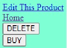

# Welcome to WALMATT

This is my second project at my Per Scholas Internship. It is a CRUD application storefront.

You can see an index of all products:

From there you can click on the image of something you may want to know more about or "purchase":

From the Show page you can Edit, go back to the Index, Delete, or "Buy" this product (which will decrease inventory by one)

## Technologies Used

Javascript  
JSX  
HTML5  
CSS  
Express JS  
MongoDB  
Mongoose  
Heroku  

## How to install locally

Navigate to my github via this link: https://github.com/mbrector/CRUDmongooseStore and then fork and clone this to your machine  
In your terminal make sure you are in the cloned folder  
Also in your terminal install needed packages with `npm install`  
You can start with a few items that I have provided with `node seeds.js`  
Finally, in your terminal run `nodemon`  
Then in your browser navigate to http://localhost:3000/products  

I also have a video of my project here: https://www.youtube.com/watch?v=hD91QoYORXI  